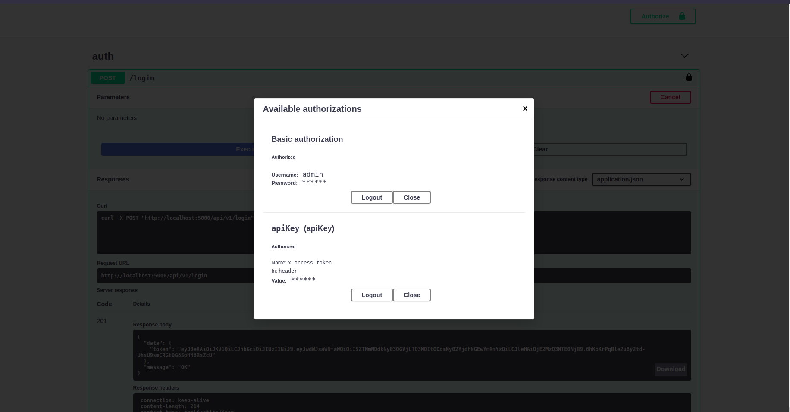
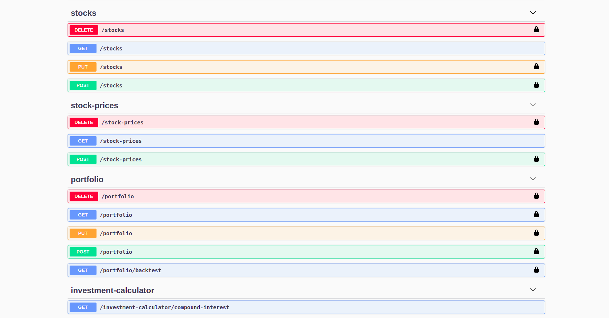

# Stock market

### Set of APIs for stocks research and portfolio backtesting. Unauthenticated users have limited access to APIs. Authentication implemented using JWT.

## Local deployment

### Requirements:

* Linux based OS (ex. Ubuntu)
* Python >= 3.6
* Docker + docker-compose
* Datasets: https://mega.nz/folder/qJ8UUARZ#Rzur_Kpr9CCn5MaIZZfuWw

### Install steps:

1. Install Python3.6 + pip
    1. sudo apt-get update
    2. sudo apt-get install python3.6
    3. python3.6 --version
    4. sudo apt install python3-pip
    5. pip3 --version
    

2. Install requirements.txt (from src)
    1. pip3 install -r requirements.txt

3. Install docker and docker-compose
    1. https://docs.docker.com/engine/install/ubuntu/
    2. https://docs.docker.com/compose/install/

4. Start elasticsearch (from src)
    1. docker-compose up elasticsearch

5. Start kibana (from src)
    1. docker-compose up kibana

6. Download datasets from  https://mega.nz/folder/qJ8UUARZ#Rzur_Kpr9CCn5MaIZZfuWw
    1. save files to stock-market/data

7. Import datasets (from src)
    1. python3.6 scripts/init_es_database/main.py
    2. python3.6 scripts/populate_es_database/main.py
   

8. Create .env file following .env\_template (default FLASK\_SECRET=thisissecret)

9. Update docker-compose.yml volume mappings (set project path on local pc)

10. Start webserver
    1. docker-compose up --build webserver

11. APIs available at http://localhost:5000
    1. Test admin/user credentials - admin:admin | user:user (log-in)
    2. Returned JWT (x-access-token apiKey) must be set in order to be able to use all APIs

    

